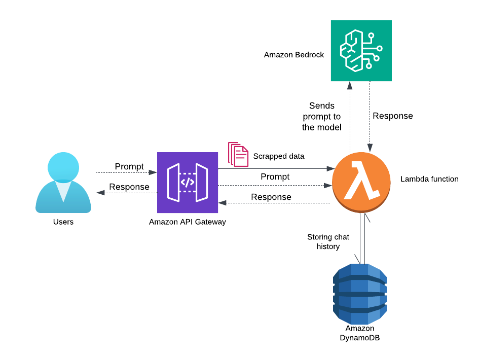
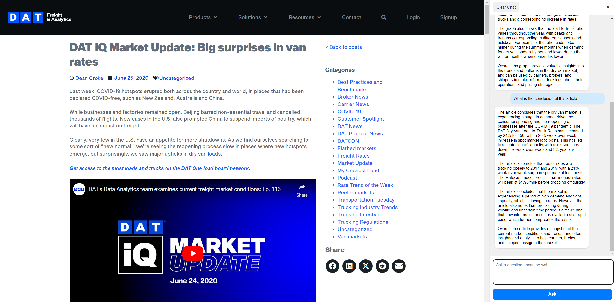
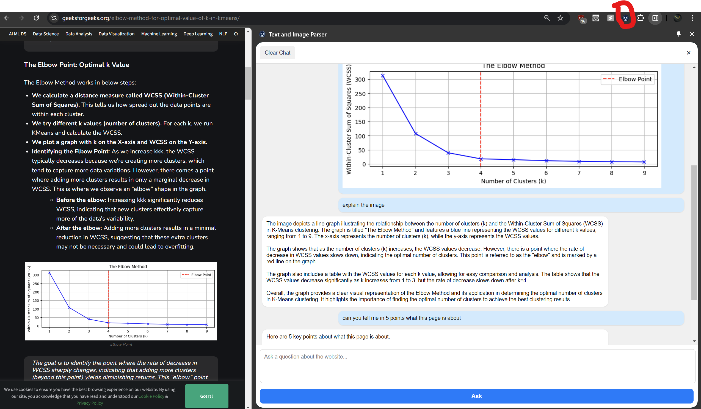

# Sitebot


Sitebot is a browser extension that will allow you to analyze a webpage and ask questions about the information on the webpage. 

This project uses AWS services such as Amazon Llama to run conversational models to respond to users questions.


## Features


- **Real-time Query Processing:** Ask questions about webpage content and receive instant responses.
- **Image Integration:** Include images in queries for enhanced analysis.
- **Persistent Chat History:** Save and access chat logs for future reference stored both locally and in DynamoDB
- **Seamless integration:** API gateway used for a seamless integration between the frontend and backend.


## Architecture




## Prerequisites

Before implementing the project, ensure you have the following:

1. **Programming Knowledge:**
   - Familiarity with HTML, CSS, JavaScript, and Python.
2. **AWS Account:**
   - Access to AWS services: Lambda, DynamoDB, API Gateway.
3. **Tools & Dependencies:**
   - A browser
   - VS code or any other code editor


## Installation and Setup

Follow these steps to set up the project:

### 1. Clone the Repository

```bash
git clone https://github.com/RekhaSrinivas/Data_650.git
cd Data_650
```


### 2. AWS setup

Make sure you have an AWS account if not create one. Create a new IAM user as follows

#### 2.1 Create an IAM user

- Login into AWS account as a root user and note down your account ID from the account settings.
- Go to the IAM dashboard (Services/Security/IAM) and select "Users" and then "Create User"
- Select a username and a password. Allow both management console access and programmatic access. 
- On the permissions page, select "Attach exiting policies directly" and select "AdministratorAccess", "AWSLambda_FullAccess", "AmazonAPIGatewayAdministrator", "AmazonDynamoDBFullAccess", "AmazonBedrockFullAccess".
- Review the settings and create the new user. You can also save the CSV file of your credentials. 

#### 2.2 Create a Lambda Function

- Logout of the root user and login into the IAM user you created in the above step.
- Navigate to Lambda function in AWS
- To create a Lambda Function:
    - Click on "create function".
    - Give your function a name.
    - Select `python 3.13` as the runtime 
    - Let the rest of settings be default and click create fucntion.
- In the editor provided create a file named `lambda_function.py` and paste the code from the github repo you cloned. Note do not change the name of this function as this name triggers the lambda function.  
- You can upload the `lambda_function.py` from the cloned folder directly to the lambda function instead of copy pasting into a new one.
- Click on deploy to deploy the lambda function. Note you have to deploy the code everytime you make a change to the lambda function.

#### 2.3 Create an API

- Navigate to API Gateway in AWS
- Create an API:
    - Click on "Create API" and select 'build' in `REST API`.
    - Give you API a name and click on create API leaving the rest of the settings to be default.
- Create a method under the resource '/':
    - Click on the resource '/' 
    - Click on create method in the bottom right corner of the page
    - Select the `POST` method and click of `Lambda fucntion` for integration type. 
    - Under the lambda function choose your lambda function (The one created in the above section).
    - Let the rest of the settings be default and create method.
- You should be able to see the POST method you just created in the resources page of your API. 
- To deploy your API
    - Click on "Deploy API"
    - Choose a stage. You can name your stage anything and give it a description. These stages help you keep track of the different working stages of your API.
    - Click on "Deploy API" and note down the API endpoint URL. We will be using this later this in our .js code. 

#### 2.4 Create a DynamoDB database to store the chat

- Navigate to DyanamoDB in AWS.
- To create a table:
    - Click on "create table" and name the table `chatHistory`. Note do not change the name of the table as it is mentioned the same in the Lambda function.
    - Let the partition key be `sessionId` of the type `String` and Sort key be `timestamp` of the type `Number`.
    - Let the remaining settings be the same then create table. 


### 3. Frontend setup

- Navigate to the frontend folder in the cloned folder.
- Open the entire folder or just the file `sidepanel.js` in a code editor. 
- Edit sidepanel.js:
    - Navigate to line 72, 266 where a contant apiEndpoint has been named as follows `const apiEndpoint = 'Your API end point'`
    - Replace it with the API end point URL you copied in the above steps.
- Load the browser extension:
    - Open your browser’s extension settings.
    - Enable "Developer mode" (for Chrome/Edge).
    - Load the frontend folder as an unpacked extension.
- You should be able to see the logo of Sitebot in your extensions.


### 4. Try the extension

- Open a webpage, click on Sitebot and ask away!
- To include images right click on images on a webpage to include them in the chat. 
- You will notice that the chat history (excluding images) will remain in the chat till the click on "clear chat". 


## Results

If you have followed all the steps above Sitebot should be up and running. Below are a few examples of what it looks like and what you will be able to see after using it.







## Limitations
- High memory usage during prolonged sessions.
- Inability to process all image formats.
- Limited Query Complexity.
- Dependency on a stable internet connection for backend communication.
